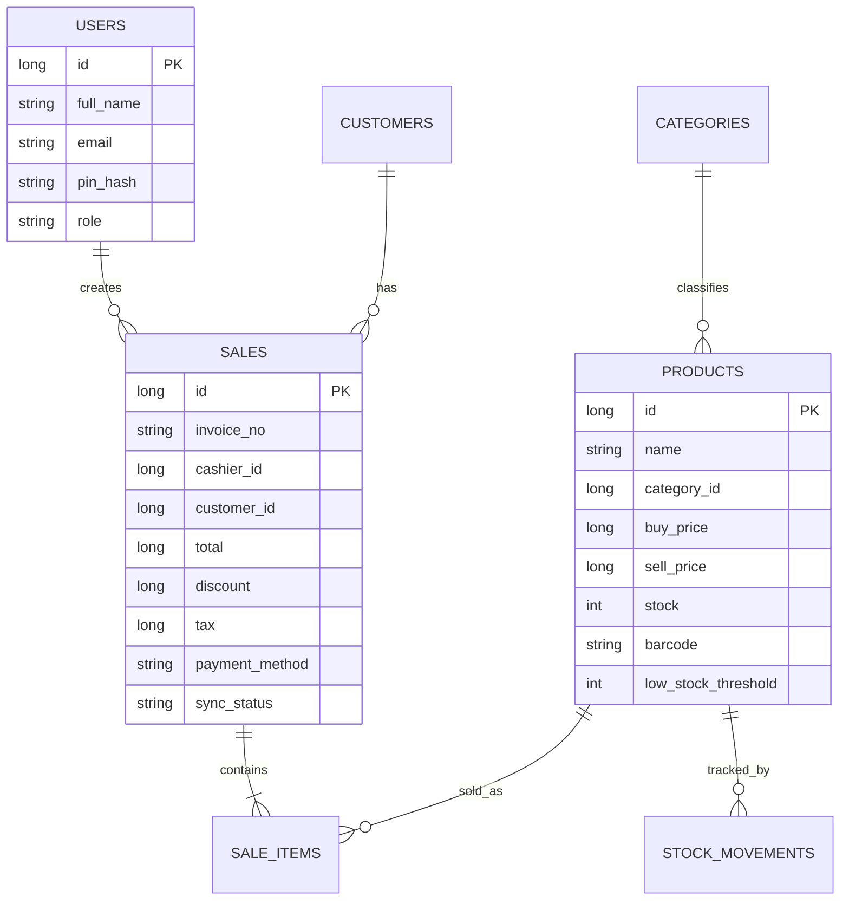

# ERD Aplikasi POS UMKM

```mermaid
erDiagram
    USERS ||--o{ SALES : creates
    CUSTOMERS ||--o{ SALES : has
    SALES ||--|{ SALE_ITEMS : contains
    PRODUCTS ||--o{ SALE_ITEMS : sold_as
    CATEGORIES ||--o{ PRODUCTS : classifies
    PRODUCTS ||--o{ STOCK_MOVEMENTS : tracked_by

    USERS {
      long id PK
      string full_name
      string email
      string pin_hash
      string role
    }
    PRODUCTS {
      long id PK
      string name
      long category_id
      long buy_price
      long sell_price
      int stock
      string barcode
      int low_stock_threshold
    }
    SALES {
      long id PK
      string invoice_no
      long cashier_id
      long customer_id
      long total
      long discount
      long tax
      string payment_method
      string sync_status
    }
```
